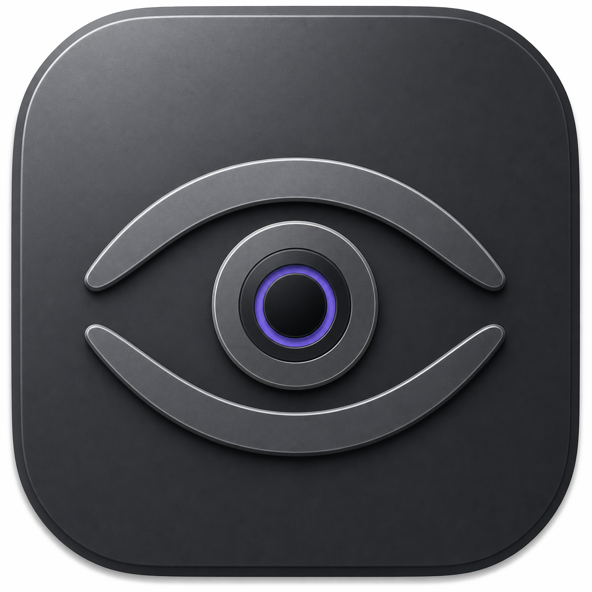

<p align="center">
  
</p>

<h1 align="center">Argus</h1>

<p align="center">
  A lightweight, native system monitor for your Mac menu bar.
</p>

<p align="center">
  <code>macOS 13+</code>&nbsp;&nbsp;·&nbsp;&nbsp;<code>Swift 6</code>&nbsp;&nbsp;·&nbsp;&nbsp;<code>AppKit + SwiftUI</code>
</p>

Argus is a small macOS app for keeping an eye on what your Mac is doing. The
menu bar gives you the quick answer, and clicking a widget opens the detail when
you actually want it.

## Why Argus?

The name comes from Argus Panoptes, the all-seeing watchman of Greek mythology.
He was said to have many eyes and was never completely asleep, which felt like a
pretty good fit for a system monitor.

The icon carries the same idea forward. Its eye was inspired by the Greek
*mati*, commonly known as the evil eye. 🧿

## What it shows

Argus has separate widgets for CPU, memory, network, storage, and battery. You
can keep all five in the menu bar or switch off anything you do not care about.

| Widget | At a glance | When opened |
| --- | --- | --- |
| **CPU** | Overall usage | History, temperature, processor speed, load averages, uptime, and top applications |
| **Memory** | Memory usage | History, pressure, app/wired/compressed/free memory, swap, and top applications |
| **Network** | Received and sent rates | Traffic history, connection and interface details, local/public IP, totals, and top applications |
| **Storage** | Read and write activity | Activity history, volume usage and capacity, and top applications |
| **Battery** | Charge and charging state | Charge history, time remaining, health, power information, and top energy users |

Every widget includes a live history graph. The graph can cover the last 30
seconds, 1 minute, 3 minutes, or 5 minutes, and you can hover over it to inspect
a particular point in time. Application lists show up to 15 of the processes
using that resource most heavily.

Open Settings with <kbd>⌘</kbd><kbd>,</kbd> to choose your widgets, refresh rate,
graph duration, animation preferences, and whether Argus should look up your
public IP and country.

## Built to stay out of the way

Argus is written in Swift using AppKit and a handful of focused SwiftUI views.
There is no Electron shell, browser engine, or Node.js runtime.

It also tries not to collect data simply because it can:

- Enabled menu-bar widgets update on one shared timer, configurable to 1, 2, or
  5 seconds.
- Disabled widgets skip their corresponding system queries.
- Application rankings are sampled only while their panel is open.
- Per-application network traffic uses a short-lived `nettop` sample only while
  the Network panel is open.
- CPU and memory readings come from native Mach and `libproc` counters.
- There is no persistent helper process or continuously running worker queue.

Open panels update once per second. Their animations stop when they close, and
all motion respects the macOS Reduce Motion setting.

## Privacy

Argus has no analytics, advertising, tracking, or user-data collection. System
statistics stay on your Mac, and preferences are stored locally.

Public IP and country lookup is the one optional network request. When enabled,
Argus contacts `ipwho.is`, with `country.is` and `ipify.org` as fallbacks. You can
turn it off in Settings. Per-application traffic is read locally through macOS's
`nettop` utility.

## Build it yourself

You will need macOS 13 Ventura or newer and Xcode 16 or newer.

```sh
git clone https://github.com/maxehmoon/Argus.git
cd Argus
./Scripts/build-app.sh
open dist/Argus.app
```

The script creates a universal Release build at `dist/Argus.app` and gives it an
ad hoc signature for local use.

To run the tests:

```sh
xcodebuild \
  -project Metrics.xcodeproj \
  -scheme Metrics \
  -destination 'platform=macOS' \
  test
```
