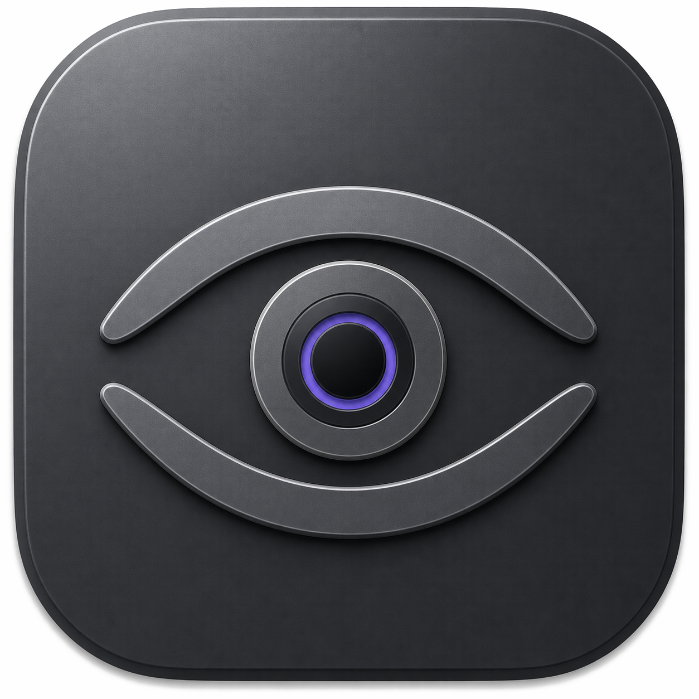

<p align="center">
  
</p>

<h1 align="center">Argus</h1>

<p align="center">
  A lightweight, native system monitor for your Mac menu bar.
</p>

<p align="center">
  <code>macOS 13+</code>&nbsp;&nbsp;·&nbsp;&nbsp;<code>Swift 6</code>&nbsp;&nbsp;·&nbsp;&nbsp;<code>AppKit + SwiftUI</code>
</p>

Argus is a small macOS app for keeping an eye on what your Mac is doing. The
menu bar gives you the quick answer, and clicking a widget opens the detail when
you actually want it.

## Why Argus?

The name comes from Argus Panoptes, the all-seeing watchman of Greek mythology.
He was said to have many eyes and was never completely asleep, which felt like a
pretty good fit for a system monitor.

The icon carries the same idea forward. Its eye was inspired by the Greek
*mati*, commonly known as the evil eye. 🧿

## What it shows

Argus has separate widgets for CPU, memory, network, storage, and battery. You
can keep all five in the menu bar or switch off anything you do not care about.

| Widget | At a glance | When opened |
| --- | --- | --- |
| **CPU** | Overall usage | History, temperature, processor speed, load averages, uptime, and top applications |
| **Memory** | Memory usage | History, pressure, app/wired/compressed/free memory, swap, and top applications |
| **Network** | Primary connection received and sent rates | Traffic history, connection and interface details, IPv4/IPv6 addresses, public IP, totals, and top applications |
| **Storage** | System-volume capacity used | Physical-disk activity history, volume usage and capacity, and application disk I/O |
| **Battery** | Charge and external-power state | Time remaining, health, battery power, and estimated CPU power by application |

CPU, memory, network and storage include a live history graph. The graph can cover the last 30
seconds, 1 minute, 3 minutes, or 5 minutes, and you can hover over it to inspect
a particular point in time. Missing readings and pauses leave gaps; a new graph
starts at its first sample. Application lists group helper processes by their
outer application bundle and show up to 15 entries.

CPU application percentages use the whole machine's capacity, including user
and kernel work. Network graphs and totals cover one primary interface (IPv4's
primary route, or IPv6's when IPv4 has none), so a VPN tunnel and its backing
link are never added together. Totals are that interface's counters since it
was created or reset. Application network rankings cover external connections
across interfaces and need not sum to the primary connection's rate.

Disk graphs add activity from physical internal and external devices, excluding
disk images. Application disk I/O uses separate process accounting; it need not
sum to physical throughput. New devices need two readings before contributing.
Unavailable readings appear as a dash, not zero.

Temperature and frequency depend on private hardware telemetry and may be
unavailable, particularly on Intel Macs. Temperature is the highest valid
candidate CPU sensor reading; frequency is weighted by active CPU residency.
Application power estimates cover CPU energy only, not GPU or total battery
drain, and are unavailable when macOS supplies no energy counters. Battery
power is measured separately from voltage and signed current.

Open Settings with <kbd>⌘</kbd><kbd>,</kbd> to choose your widgets, refresh rate,
graph duration, animation preferences, whether Argus should start at login,
and whether it should look up your public IP and country.
Settings also includes an optional permission action to display your Wi-Fi name.

## Built to stay out of the way

Argus is written in Swift using AppKit and a handful of focused SwiftUI views.
There is no Electron shell, browser engine, or Node.js runtime.

It also tries not to collect data simply because it can:

- Enabled menu-bar widgets update on one shared timer, configurable to 1, 2, or
  5 seconds.
- Disabled widgets skip their corresponding system queries.
- Application rankings are sampled only while their panel is open.
- Per-application network traffic uses a short-lived `nettop` sample only while
  the Network panel is open.
- CPU and memory readings come from native Mach and `libproc` counters.
- There is no persistent helper process or continuously running worker queue.

Open panels target one update per second. Slow collectors can take longer;
failed collectors are paced too. Network process samples have a four-second
timeout and are cancelled when their panel closes. Animations stop when panels
close and respect both the app's animation preference and macOS Reduce Motion.

## Privacy

Argus has no analytics, advertising, tracking, or user-data collection. System
statistics stay on your Mac, and preferences are stored locally.

Public IP and country lookup makes an optional network request. When enabled,
Argus contacts `ipwho.is`, with `country.is` and `ipify.org` as fallbacks. You can
turn it off in Settings. Per-application traffic is read locally through macOS's
`nettop` utility. Sparkle also checks the project's update feed for app updates.

macOS requires Location Services permission to reveal a Wi-Fi network's name.
Argus requests this only when you choose **Allow Wi-Fi Name…** in Settings.
It does not request location updates or store coordinates. Network rates and
other readings work without this permission.

## Build it yourself

You will need macOS 13 Ventura or newer and Xcode 16 or newer.

```sh
git clone https://github.com/maxehmoon/Argus.git
cd Argus
./Scripts/build-app.sh
open dist/Argus.app
```

The script creates a universal Release build at `dist/Argus.app` and gives it an
ad hoc signature for local use.

To run the tests:

```sh
xcodebuild \
  -project Metrics.xcodeproj \
  -scheme Metrics \
  -destination 'platform=macOS' \
  test
```
